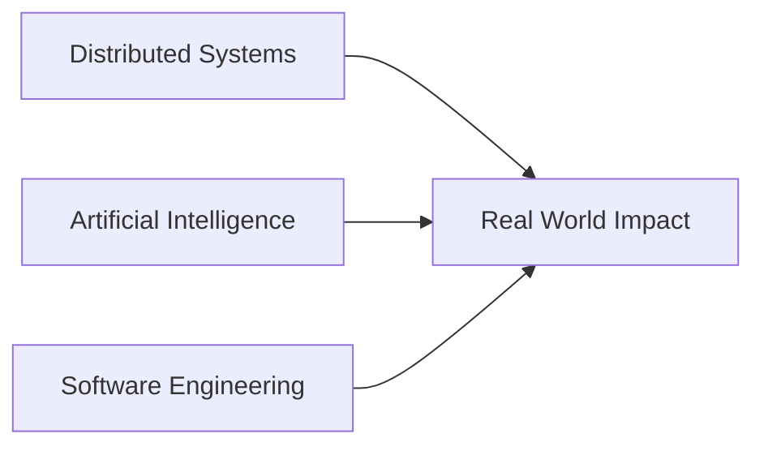

<div align="center">

<p align="center">
  
</p>

[](#)
[](#)
[](#)
[](#)

[](#)
[](#)

</div>

---

## 💡 About Me

Most developers build applications.

I enjoy building the systems behind them.

I'm a penultimate-year Information Technology student at **Vishwakarma Institute of Technology (VIT Pune)**, passionate about building **distributed systems, AI-powered applications, and scalable software**.

My journey combines:

* 💻 Competitive Programming (450+ DSA problems, LeetCode 1670)
* 🚀 National-Level Hackathons (SIH 2025 Grand Finalist)
* 🌱 Open Source Contributions (GSSoC'24 Contributor)
* 📊 Data Science & Analytics (Summer Analytics Trainee at IIT Guwahati × HackerEarth)
* 🤖 AI/ML & Distributed Systems Engineering

My goal is simple:

> Design intelligent, reliable, and scalable systems that create meaningful impact at scale.

---

## 📊 Engineering Dashboard

<table>
<tr>
<td>

### 🚀 Current Focus

* Distributed Systems
* Event-Driven Architectures
* AI Agents & LLM Systems
* System Design
* Backend Engineering

</td>

<td>

### 🎯 Current Goals

* 1800+ LeetCode Rating
* Google SWE Intern 2027
* Open Source Contributions
* Advanced System Design
* Production-Scale AI Systems

</td>
</tr>
</table>

---

## 🌟 Experience Snapshot

### Summer Analytics Trainee

**IIT Guwahati × HackerEarth**

* Building end-to-end Machine Learning and Analytics pipelines
* Applying feature engineering and model optimization techniques
* Developing dashboards, visualization systems, and data-driven solutions
* Working alongside a national cohort of analytics enthusiasts

### Open Source Contributor

**GirlScript Summer of Code (GSSoC'24)**

* Contributed to open-source projects
* Collaborated with maintainers and developers across the community
* Improved code quality, documentation, and project functionality
* Strengthened software engineering and collaborative development skills

---


## 🧠 Engineering Philosophy



Technology is valuable only when it solves meaningful problems.

That's why I enjoy working on projects ranging from AI-powered fraud detection systems to assistive technologies and large-scale supply chain intelligence platforms.

---

## ⚡ Competitive Programming

```yaml
Solved: 450+ Problems

Platforms:
  - LeetCode
  - Codeforces
  - CodeChef

Peak LeetCode Rating:
  1670

Favorite Topics:
  - Graphs
  - Dynamic Programming
  - Trees
  - Greedy
  - Sliding Window
  - System Design Thinking
```

I enjoy breaking down complex problems into elegant and efficient solutions.

---

## 📈 GitHub Activity

## 📊 GitHub Analytics

<p align="center">
  
  
</p>

---

## 📈 Contribution Activity Graph

<p align="center">
  
</p>

---

## 💻 LeetCode Profile

<p align="center">
  
</p>


---

## 🌍 Why I Build

Whether it's:

* Building an EEG-powered smart wheelchair
* Detecting fraud using AI
* Designing distributed systems
* Optimizing supply chains with intelligent agents

I enjoy creating technology that scales beyond prototypes and delivers measurable impact.
